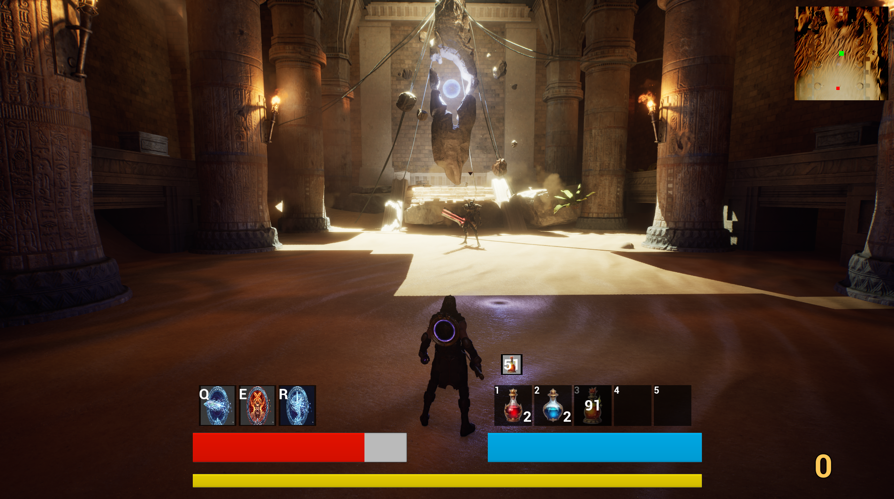

# Desert Guardian — 3인칭 액션 RPG

> 아이온2를 레퍼런스로 한 MMORPG 기반의 3인칭 액션 어드벤처 싱글플레이 ARPG

---

## 개요

| 항목 | 내용 |
|------|------|
| 엔진 | Unreal Engine 5.6 |
| 언어 | C++ 70% / Blueprint 30% |
| 개발 기간 | 2026.01 ~ 2026.03 (약 2개월 반) |
| 개발 형태 | 1인 개발 |

---

## 인게임 스크린샷



---

## 시연 영상

[](https://youtu.be/7G13lTbAaio)

---

## 주요 구현 기능

### 전투 시스템
- 3단 근접 콤보 공격 및 3단 마법 콤보
- 점프 공격, 구르기 등 액션 어드벤처 기반 전투
- HP / MP / SP 스탯 관리 및 마나 자동 회복

### 자동 타겟팅 시스템
- 카메라 전방 벡터 기준 내적(Dot Product) 연산으로 화면 중심에 가장 가까운 적 자동 선정

### 스킬 시스템
- 3개 퀵슬롯(Q, E, R) 기반 스킬
- 투사체 스킬과 버프 스킬
- 각 스킬별 고유 쿨타임과 버프 지속 시간 UI 표시

### 적 AI 시스템
- `AEnemy → NormalMonster + EliteMonster + BossMonster` 계층 구조
- AI Perception(시야 감지) + Behavior Tree 기반 행동
- 리쉬(Leash) 시스템: 일정 거리 이탈 시 스폰 위치로 복귀
- 오브젝트 풀링(`ObjectPoolSubsystem`)으로 스폰/사망 비용 최소화

### 보스 시스템
- 1페이즈, 2페이즈 구분 (페이즈 전환 연출 + 공격 패턴 변화)
- 점프 공격 시 데칼로 경고 범위 표시

### 인벤토리 / 퀵슬롯 / 상점
- 아이템 획득, 장착, 사용 시스템
- 소비 아이템 퀵슬롯 (슬롯 교환, 쿨다운 관리)
- NPC 상점 구매 UI (장바구니 → 일괄 구매)

### 퀘스트 시스템
- 수락 / 진행 / 완료 상태 관리
- 선행 퀘스트 / 보스 처치 등 조건 설정 기능 포함

### 데이터 기반 설계
- 적 스탯, 아이템, 스킬, 퀘스트, 대화, 포털 정보를 DataTable로 관리
- 코드 수정 없이 에디터에서 게임 데이터 수정 가능

---

## 아키텍처

### 플레이어 — 컴포넌트 패턴
`MyCharacter`가 기능별 컴포넌트를 조합하는 구조:

```
MyCharacter
├── CombatComponent     — 전투/스탯
├── SkillComponent      — 스킬/퀵슬롯
├── TargetingComponent  — 자동 타겟팅
├── InventoryComponent  — 인벤토리
├── QuickSlotComponent  — 소비 아이템 슬롯
└── MoneyComponent      — 재화
```

### 전역 상태 — 서브시스템 패턴
`UGameInstanceSubsystem` 상속으로 게임 인스턴스 전체에서 접근 가능한 싱글톤:

```
InventorySubsystem / QuickSlotSubsystem / SkillSubsystem
MoneySubsystem / StatSubsystem / UISubsystem
ObjectPoolSubsystem / QuestSubsystem / WarningSubsystem
```

---

